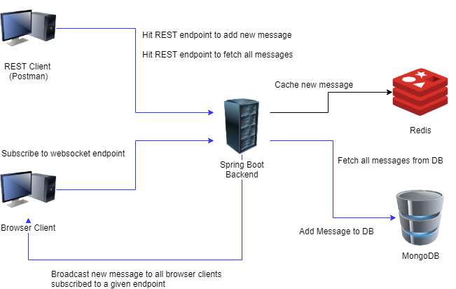

## Overview:
The primary target for this code sample is to design and develop a Java Back-end server that will:
1. Register Redis message listener and consumer
2. Register WebSocket end points
3. Accept (REST API) incoming messages and cache them in Redis. Once done will broadcast them to all browser clients via WebSocket
4. (Redis) consumer will receive each new message and persist them in MongoDB
5. Expose (REST API) endpoint for retrieving all stored messages in MongoDB

For testing purposes, there is also a simple browser client/front-end that will display the new messages broadcasted from the back-end

## High Level Design:

## Technologies/Tools/Frameworks used:
- Java JEE / Spring Boot 1.5.2.RELEASE
- MongoDB (latest)
- Redis Server (latest)
- WebSocket (Spring Boot)
- AngularJS 1.x
- Bootstrap v4.0
- Sock.js & Stomp.js (for WebSocket)
- HTML/CSS
- Tomcat 8.x/9.x
- Docker

## Exposed endpoints:
### Endpoint: /message
Type: REST endpoint 
HTTP method: POST 
Headers:
<pre>Content Type: application/json</pre>
Purpose: add new message. This message will be broadcasted to client using WebSocket. 
Sample Payload:
<pre>
{
    "message": "Some message"
}
</pre>

Sample Response:
<pre>
{
    "status": "OK",
    "status_message: ""
}
</pre>

Sample endpoint URL: 
If deployed in localhost, then the URL will look like the following: 
http://localhost:8080/websocket/message

### Endpoint: /message
Type: REST endpoint 
HTTP method: GET 
Headers:
<pre>Content Type: application/json</pre>
Purpose: retrieve all stored messages (from MongoDB) 
Sample Response:
<pre>
{
    "status": "OK",
    "status_message: "",
    "result": ""
}
</pre>

Sample endpoint URL: 
If deployed in localhost, then the URL will look like the following: 
http://localhost:8080/websocket/message

### Endpoint: /socket/newmsg
Type: WebSocket 
Purpose: Front-end client will subscribe to this endpoint. All new messages, received by server, will be broadcasted through this endpoint to all subscribed clients. 

Sample endpoint URL: 
If deployed in localhost, then the URL will look like the following: 
http://localhost:8080/websocket/socket/newmsg

## Execution:
Linux environment is preferred for Docker and Redis

### Steps (Server) - without docker-compose:
1. Install MongoDB. It should listen to default port 27017. For customized configuration (with respect to port, database, username, and password), please refer to step 10.
2. Install Redis Server. It should listen to default port 6379.
3. Install Tomcat 8.x/9.x. Tested with 9.x
4. Install Eclipse. Developed using Neon 3. Install Spring STS from Eclipse Marketplace.
5. Install Git and a Git client like SmartGit.
6. Install Maven 3.5 (preferred). Developed using 3.5
7. Install a REST client like Postman.
8. Checkout sourcecode from this repository and import "backend" folder contents in Eclipse as Maven project. Clean and update Maven dependencies.
9. Add and configure Tomcat Server in Eclipse.
10. Modify the following lines in "application.properties" file:
- Change "spring.data.mongodb.host=mongodb" to "spring.data.mongodb.host=localhost"
- Change "spring.redis.host=redis" to "spring.redis.host=localhost"
- For custom configuration of MongoDB (port, database, username, and password), please uncomment and modify the following lines:
<pre>
spring.data.mongodb.port=3100 (custom port number as assigned during installation or mongodb configuration)
spring.data.mongodb.username=username (mongodb user name)
spring.data.mongodb.password=password (mongodb password)
spring.data.mongodb.database=local (or any other database name)
spring.data.mongodb.authentication-database=admin
Note: The above configuration should be modified carefully. Else, entire functionality will break.
</pre>
11. Run the application on Tomcat Server (Eclipse)

### Steps (Client) - without docker-compose:
1. Launch Firefox and open "index.html" in "websocket_client" folder. Please do not open the page in any other browser, as it might break functionality or throw error.

Once both Client and Server are running, hit the above mentioned REST endpoints with the installed REST client and see web sockets in action.

### Steps - with docker-compose:
1. Install docker and docker-compose.
2. Install Git and a Git client like SmartGit.
3. Install a REST client like Postman.
4. Checkout sourcecode from this repository.
5. Execute "docker-compose up" from within the checked out source code folder root (where docker-compose.yml is located)

Once both Client and Server are running, hit the above mentioned REST endpoints with the installed REST client and see web sockets in action.

## Pending work:
I intended to do the following using docker-compose:
1. Install and run MongoDB image and listen to default port 27017
2. Install and run Redis Server image and listen to default port 6379
3. Install and run Tomcat Server and expose port 8080
4. Build and run Spring Boot Server application using Maven. Once done, deploy WAR on Tomcat.
5. Install and run Firefox image. Once done, open the root URL of deployed back-end and open "index.html" of "websocket_client"
6. Finally, if possible install and run Postman.

However, I am yet to figure out how to deploy WAR on Tomcat and open Firefox with the above mentioned URLs. I am new to Docker and still learning :)
